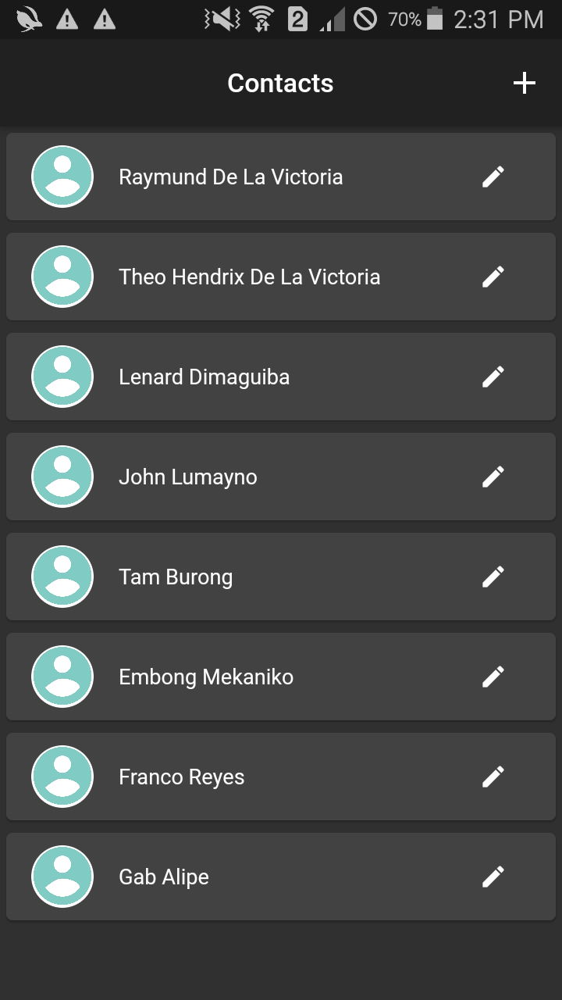

## A Simple Contact Application created in flutter with the implementation of REST API created in Node JS with the express framework and MongoDB Atlas for the Database.

### Home Page

### Input Contact Information

### View Contact Information

### Delete Contact

### Edit Contact

